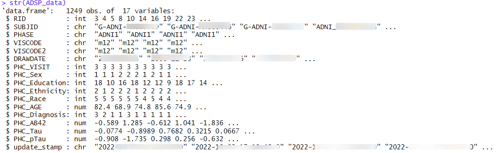
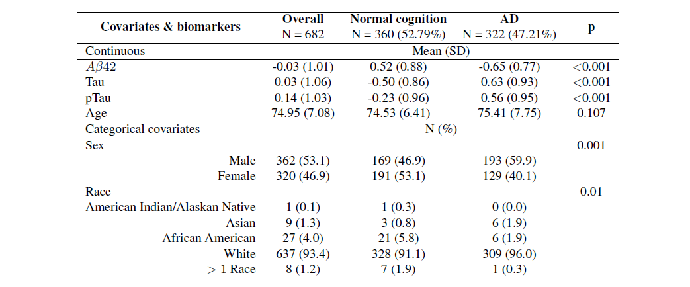

# Covariate-wise-optimal-cutoff
This repository will contain R codes used for simulation and data analysis of the paper titled **"Impact of methodological assumptions and covariates on the cutoff estimation in ROC analysis"**. This file will not perform any analysis directly, rather, it guides to several R files located in the GitHub repository titled "Covariate-wise-optimal-cutoff" ([Link](https://github.com/soutikghosal/Covariate-wise-optimal-cutoff)). The repository contains 2 subfolders namely: i) Simulation, and ii) Data Analysis. Each of them contains relevant codes for the simulation and data analysis respectively. The raw data is not shared in the repository as a Data User Agreement is required to acquire the data. All R codes shared in the respective folders will be able to generate the relevant tables (with numbers) and figures used in the manuscript. This file will be publicly shared in the repository as well for guidance. Comments should be used throughout to explain decisions made and reference which paper result is being generated. 

# Publication
This file reproduces the results from the publication:

* Title: Impact of methodological assumptions and covariates on the cutoff estimation in ROC analysis
* Authors: Soutik Ghosal
* Journal: TBD
* Date Code Written: 2024 October 15
* Code Author: Soutik Ghosal
* R version used: R version 4.3.2 (2023-10-31) -- "Eye Holes"
* Operating system: Mac OS
* Data Dictionary filename:

# Simulation

The simulation performed in the paper primarily uses 2 frameworks: i) without covariate, and ii) with covariate. The simulation is mainly performed in the University of Virginia's supercomputer Rivanna and then the compilation and summarization of the simulation is done using R (version 4.3.2 (2023-10-31) -- "Eye Holes") in a Macbook Pro.

## Simulation without covariate

For performing simulation without covariate, the main R code that is used is `Sim_func.R`. It contains all necessary functions to generate data from no covariate setup under different data generating frameworks (`BN.equal()`, `BN.unequal()`, $\ldots$, `Mixed.I()`, `Mixed.II()`), different ROC model fitting frameworks (`Empirical_func()`, `NonPar_func()`, `BiNormal_func()`, `PV_func()`, `SemiPar_func()` etc.). The function `cutoff.func()` takes arguments of seed, sample size, data generating mechanism, and AUC level to generate the data, true ROC curve, AUC and cutoff values, along with the fit of all the models.

There are several other R scripts that are of structure: `Sim_[]Samp_[]AUC.R` where the blanks are populated with different levels of sample size levels (Low, Medium, and High) and AUC levels (Low, Medium, and High) respectively. Each of these is capable of generating multiple replicates (in our case, it is 1000) of data given a particular sample size level and AUC level, and combining estimates from different ROC fitting models. We used one of the University of Virginia's High-Performance Computing (HPC) Systems **Rivanna** to fit those models for simulation. Each of those 9 R scripts created 1000 files containing ROC fitting models' estimates obtained from 1000 replicates of data, making 9000 different files from all the R scripts.

Once those 9000 files were obtained, they were summarized using the R script named as `compile_sim_nocov_all_figure.R`. This file contains functions such as `summary.tab()`, `bias.table.me()` which respectively summarizes the AUC, ROC estimates, and biases obtained from AUC and several optimal cutoff frameworks. These functions are useful to create Tables 3a - 3c (in the main manuscript), Tables B.3a - B.3c, B.4a - B.4c (in the online supplement). There are other several functions (primarily objects such as `allbutAUC.noCon.bias.plot` and `AUC.noCon.bias.plot`) that would create the bias plots Figures B.1 - B.18 (in the online supplement).

## Simulation with covariate

For performing simulation with covariate, the main R code that is used is `Sim_func_cov.R`. It contains all necessary functions to generate data with covariate setup under different data generating frameworks (`BN()`, `Skewed()`, `Mixed()`), different ROC model fitting frameworks (`BiNormal_reg_fit()`, `BayesPV_reg_fit()`, `SemiPar_reg_fit()` etc.). In these frameworks, for all sample size levels, the healthy and diseased covariates (respectively, $X_0$ and $X_1$ were generated from $Uniform(-0.5, 1.5)$, and the ROC curve, AUC, and cutoff estimates were obtained at $x=0$, and $x=1$). The function `cutoff.func()` takes arguments of seed, sample size, data generating mechanism, and AUC level to generate the data, true ROC curve, AUC, and cutoff values, along with the fit of all the models.

There are 3 R scripts which are of structure: `Sim_[]Samp_cov.R` where the blank is populated with different levels of sample size levels (Low, Medium, and High). Each of these is capable of generating multiple replicates (in our case, it is 1000) of data given a particular sample size level and combining estimates from different ROC fitting models. For this too, we used **Rivanna** to fit those models for simulation. Each of those 3 R scripts created 1000 files containing ROC fitting models' estimates obtained from 1000 replicates of data, making 3000 different files from all the R scripts.

Once those 3000 files were obtained, they were summarized using the R script named `compile_sim_cov_all_figure.R`. This file contains functions such as `summary.tab()`, `bias.table.me()` which respectively summarizes the AUC, ROC estimates, and biases obtained from AUC and several optimal cutoff frameworks. These functions are useful for creating Tables 6 (in the main manuscript), Tables B.5 - B.6 (in the online supplement). There are other several functions (primarily objects such as `allbutAUC.bias.plot` and `AUC.bias.plot`) that would create the bias plots Figures B.19 - B.24 (in the online supplement).

# Data Analysis

The R codes pertaining to the data analysis are located in the `Data Analysis` folder of the repository. The data analysis portion is performed using R (version 4.3.2 (2023-10-31) -- "Eye Holes") in a Macbook Pro.

## Source

Data used in this article were obtained from the [Alzheimer’s Disease Neuroimaging Initiative (ADNI) database](adni.loni.usc.edu). The ADNI was launched in 2003 as a public-private partnership, led by Principal Investigator Michael W. Weiner, MD. The primary goal of ADNI has been to test whether serial magnetic resonance imaging, positron emission tomography, other biological markers, and clinical and neuropsychological assessment can be combined to measure the progression of mild cognitive impairment and early Alzheimer’s disease (AD). 

* Attribution for data source: ADSP Phenotype Harmonization Consortium (PHC)
* Date data was received: March 2024
* Cohort requested: Fluid biomarkers ($A\beta 42$, tau, and p-tau) information of samples along with demographic information (such as age, biological sex, race, etc.) and final outcome (Alzheimer/normal cognition) 

## Data

In this context, our aim is to assess the diagnostic accuracy and determine the optimal cutoffs for various fluid biomarkers in AD diagnosis. The focus biomarkers include plasma amyloid- $\beta$ ($A\beta 42$), tau (total-tau or t-tau), and phosphorylated tau (p-tau). To achieve this, we utilized the dataset from the **ADSP Phenotype Harmonization Consortium (PHC)**, which collected fluid biomarker levels from various studies and cohorts, and then merged the biomarker data across these cohorts. The fluid biomarker scores were harmonized across datasets such as ADNI, the National Alzheimer’s Coordinating Center (NACC), and the Memory and Aging Project at Knight Alzheimer’s Disease Research Center (MAP at Knight ADRC). Subsequently, the scores were co-calibrated and standardized to create z-score versions of the biomarkers. This biomarker information is available for a sample of 1249 subjects and their final outcome is categorized as: "Normal cognition", "Mild cognitive impairment", and "Alzheimer". Overall the data has the following 17 variables:

  
Among all, we only use the sample excluding "Mild cognitive impairment", which results in a sample of 682 subjects. We only retain a few variables of our interest. The complete data can be accessed following approval from the database account. The metadata (also Table 7 of the manuscript) is provided below:

## Overall analysis (i.e. analysis without covariate)

To perform the overall analysis, the functions to fit different ROC models are stored in the R script named `data_func.R`. It has all the functions such as `Empirical_Boot()`, `NonPar_Boot()`, `BiNormal_func()`, `PV_func()`, and `SemiPar_func()` to fit the distributions discussed in the manuscript. The R script `ADNI_ADSP_PHC_biomarker_data_analysis.R` performs the overall analysis for this segment. It sources the `data_func.R` to call the model fitting functions. Before that, it calls the data, cleans the data, and creates Table 7. Then it performs the model fitting using the `nocov_analysis()` function. Then it summarizes the ROC, AUC, and cutoffs using several functions such as `cutoff.summ.tab()`, `AUC.summ.tab()`, `AUC.cutoff.summ.tab()`, `ROC.summ.tab()` etc. Table 8 is also a byproduct of these functions. Furthermore, it combines all the ROC curves and creates Figure 1 (in the manuscript). Figure 2 of the manuscript is created using the `whole.summ()` function which extracts the cutoff estimates for different biomarkers and different models and plots on the different biomarkers' densities.

## Sex-specific analysis (i.e. analysis with covariate)

To perform the sex-specific analysis, the functions to fit different ROC models are stored in the R script named `data_func_cov.R`. It has all the functions such as `BiNormal_reg_fit()`, `BayesPV_reg_fit()`, and `SemiPar_reg_fit()` to fit the distributions discussed in the manuscript. The R script `ADNI_ADSP_PHC_sex.R` performs the sex-specific analysis for this segment. It sources the `data_func_cov.R` to call the model fitting functions. Then it performs the model fitting using the `cov_analysis()` function. Then it summarizes the ROC, AUC, cutoffs using several functions such as `cutoff.summ.tab()`, `AUC.summ.tab()`, `AUC.cutoff.summ.tab()`, `ROC.summ.tab()` etc. Table 9 is also a byproduct of these functions. Furthermore, it combines all the ROC curves and creates sex-specific ROC curves in Figure 3 (in the manuscript). Figures 4 - 6 of the manuscript are created using the `whole.summ()` function which extracts the sex-specific cutoff estimates for different biomarkers, and different models and plots on the different biomarkers' densities.

# All at once

The `All at once` folder contains the master file `master.R` that contains all the codes to reproduce the exact same simulation and similar data analysis. Relevant subfolders within this folder have relevant information for this spanning data analysis, reproducing the same simulation result, and conducting a similar simulation. Data files storing the performed simulation can be found [here](https://drive.google.com/drive/folders/1v9l25cBHYL6pd7nq9K8gVGTX-cVt5qq1?usp=drive_link). 
